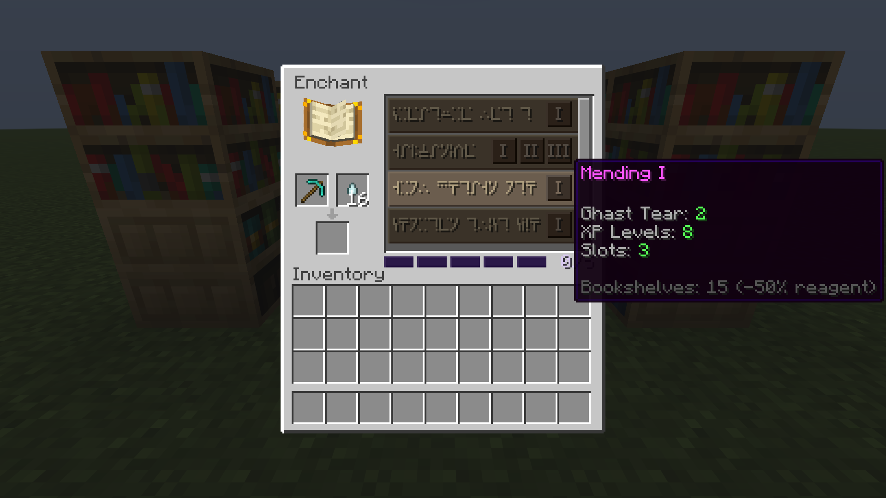

# Enchanting Table (Magic Only)

The enchanting table keeps the same block and appearance. The UI changes completely. A catalogue replaces vanilla RNG. You pay with a reagent and XP.

## Slot System

Each enchantable item has a max slot count determined by the material. Each enchantment level costs 1 slot. You cannot exceed the maximum.

| Material | Slots | Examples |
|---|---|---|
| Leather / Wood / Stone | 3 | Mending (3) fills everything |
| Copper | 3 | Same as Leather |
| Iron / Chainmail | 4 | Mending (3) + Fortune I (1) |
| Diamond | 5 | Mending (3) + Fortune II (2) |
| Netherite | 5 | Same as Diamond |
| Gold | 6 | Fortune III (3) + Thorns III (3) |

Gold has 6 slots and the lowest protection. By design, gold rewards players who sacrifice defense for magical options.

Special items: Trident/Mace/Elytra (5), Turtle Helmet (5), Crossbow (4), Bow/Fishing Rod (3).

### Slot Rules
- 1 level = 1 slot
- Exception: Mending costs 3 slots
- Curses cost 0 slots and grant +1 bonus slot each
- The grindstone removes all enchantments without costing any slot

## Adding Enchantments to the Catalogue

Find enchanted books in structures, place them in chiseled bookshelves around the enchanting table. The enchantment appears in the catalogue. The book is not consumed and acts as a permanent key.

Chiseled bookshelves with books emit enchanting particles toward the table, showing the connection visually. Hovering on a slotted book in a chiseled bookshelf shows the enchantment name above the hotbar without breaking the shelf.

Normal bookshelves reduce reagent cost. The discount is linear: each bookshelf reduces the reagent cost by ~3.3%, up to 15 bookshelves for a 50% discount. Beyond 15 bookshelves there is no additional benefit.

## Upgrading Enchantments

You can raise an enchantment already on an item to a higher level without stripping it first. An applied enchantment that is below its max level appears in the catalogue with its owned levels shown as greyed, non-clickable pips, and only the next levels selectable. The tooltip reads "N → M".

The cost is the delta: slots, reagent, and XP are charged as the new level minus the current level, so reaching a level costs the same total whether you applied it directly or upgraded into it, with the same number of bookshelves. Reagent costs are rounded before taking the difference. Curses and single-level enchantments are not upgradeable.

The vanilla Stronghold Library has been remodeled into a starter enchanting room. The center now hosts an obsidian pedestal flanked by chiseled bookshelves pre-filled with random enchanted books drawn from the early-game pool. This gives you a guaranteed first taste of the enchanting catalogue once you reach the Stronghold.

## UI Layout

Left side (3 slots): item on top, reagent beside it, result on the bottom.

Right side (scrollable catalogue): each row shows the enchantment in the enchanting table's runic script and a level selector (I, II, III...). Hovering shows the enchantment's name with its reagent, XP, and slot costs. Unaffordable rows and level buttons appear dimmed and are not clickable. A selected level stays selected while you add or swap reagents, and the result appears as soon as you can pay.

Bottom (visual slot bar): pips show used, pending, and free slots. Scales to fit any slot count.

## Cost

Each enchantment costs a specific reagent and XP levels:
- Reagent: a thematic item specific to each enchantment. Each enchantment has its own cumulative price curve; see the [[reagent table|Enchantment List]]. Normal bookshelves reduce the price by up to 50% at 15 bookshelves, rounded up. Mending costs four Ghast Tears before discounts (two with 15 bookshelves); Silk Touch remains two Cobwebs (one with 15 bookshelves).
- XP levels: 2 (level I), 4 (level II), 7 (level III), 10 (level IV+). Mending always costs 8 XP regardless of level.

### Example: Fortune III on Diamond Pickaxe (5 slots, 10 bookshelves)

| Level | Slots | Reagent (Emerald) | Reagent (reduced) | XP |
|---|---|---|---|---|
| I | 1 | 8 | 6 | 2 levels |
| II | 2 | 20 | 14 | 4 levels |
| III | 3 | 36 | 24 | 7 levels |

These are cumulative prices. At ten bookshelves, upgrading Fortune I to II costs eight emeralds, and II to III costs ten. Including the six paid for level I, the total is 24, equal to applying level III directly. The tooltip shows the bookshelf discount separately from the exact reagent quantity charged.

## Curses

Curses cost 0 slots and grant +1 bonus slot instead. This is the primary way to expand an item beyond the material limit. Risk/reward tradeoff.

| Curse | Negative Effect | Bonus |
|---|---|---|
| Curse of Fragility | Double durability damage | +1 slot |
| Curse of Hunger | 30% faster hunger per piece | +1 slot |
| Curse of Binding | Cannot remove armor | +1 slot |
| Curse of Vanishing | Item disappears on death | +1 slot |

## Grindstone

Removes all enchantments, curses included, and leaves every slot free (see [[Anvil and Grindstone]]).
